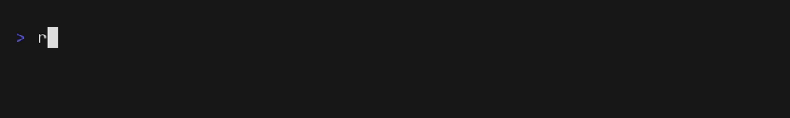
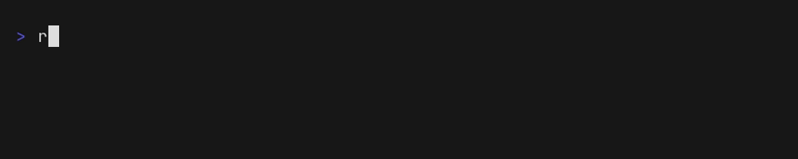

# [BETA] | submodel Python CLI Reference

Note: This CLI is not the same as submodelctl and provides a different set of features.

## Getting Started

### Configure

Store your submodel API key by running `submodel config`. Optionally you can also call the command with your API key `submodel config YOUR_API_KEY` or include the `--profile` to save multiple keys (stored under "default" profile is not specified) Credentials are stored in `~/.submodel/config.toml`.

Add a SSH key to you account by running `submodel ssh add-key`. To specify and existing key pass in `--key` or `--key-file` to use a file. Keys are stored in `~/.submodel/ssh/`.  If no key is specified a new one will be generated and stored.

## submodel Project

A "project" is the start of a serverless worker. To get started call `submodel project new`, you will be asked a few questions about the project you are creating, a project folder will be created. You can now navigate into your repo and run `submodel project start`.

Once you are finished developing you can run `submodel project deploy` to deploy your project and create an endpoint.
